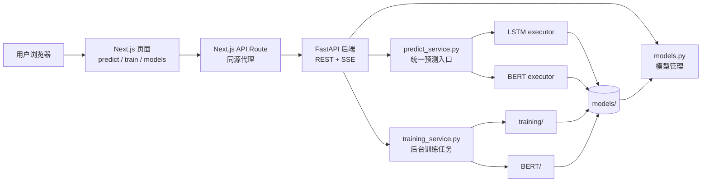
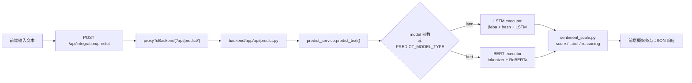
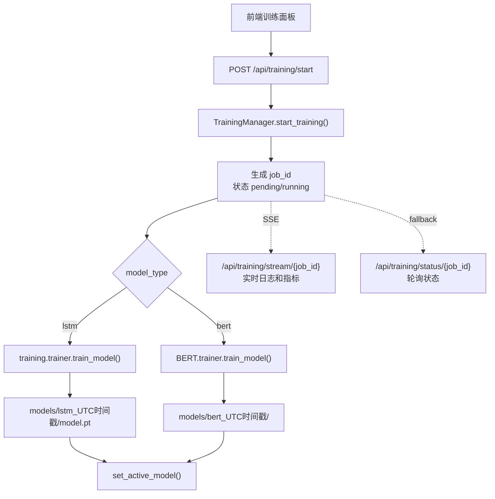
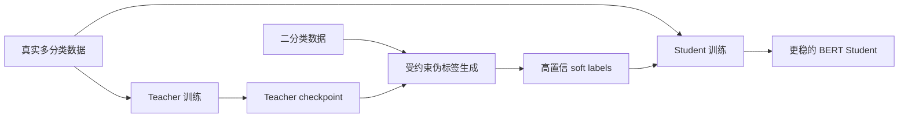

# SentimentFlow

中文情感分析全栈系统

<div class="mt-6 text-lg opacity-85">
0-5 六档情感评分 · 在线推理 · 后台训练 · 模型管理
</div>

<div class="mt-10 flex flex-wrap justify-center gap-2 text-sm">
  <span class="rounded-full border border-white/25 px-3 py-1">Next.js</span>
  <span class="rounded-full border border-white/25 px-3 py-1">FastAPI</span>
  <span class="rounded-full border border-white/25 px-3 py-1">PyTorch</span>
  <span class="rounded-full border border-white/25 px-3 py-1">Transformers</span>
  <span class="rounded-full border border-white/25 px-3 py-1">Slidev</span>
</div>

<!--
开场先用一句话定调：SentimentFlow 不是单一模型脚本，而是把训练、模型管理、推理服务和前端交互打通的一套完整工程闭环。
-->

---

# 汇报结构

<div class="grid grid-cols-2 gap-5 mt-8">
  <div class="rounded-xl border border-slate-200 bg-white/80 p-5 shadow-sm">
    <div class="text-xs uppercase tracking-wide text-slate-500">Part 01</div>
    <h3 class="mt-2 text-xl font-semibold">项目目标与核心价值</h3>
    <p class="mt-2 text-sm text-slate-600">解释项目解决什么问题，为什么要做 0-5 六档评分。</p>
  </div>
  <div class="rounded-xl border border-slate-200 bg-white/80 p-5 shadow-sm">
    <div class="text-xs uppercase tracking-wide text-slate-500">Part 02</div>
    <h3 class="mt-2 text-xl font-semibold">整体架构与请求链路</h3>
    <p class="mt-2 text-sm text-slate-600">从浏览器、API 代理、FastAPI 到 LSTM/BERT 执行器。</p>
  </div>
  <div class="rounded-xl border border-slate-200 bg-white/80 p-5 shadow-sm">
    <div class="text-xs uppercase tracking-wide text-slate-500">Part 03</div>
    <h3 class="mt-2 text-xl font-semibold">模型路线与训练策略</h3>
    <p class="mt-2 text-sm text-slate-600">LSTM baseline、BERT 主力模型、Teacher/Student 伪标签。</p>
  </div>
  <div class="rounded-xl border border-slate-200 bg-white/80 p-5 shadow-sm">
    <div class="text-xs uppercase tracking-wide text-slate-500">Part 04</div>
    <h3 class="mt-2 text-xl font-semibold">部署、测试与演示</h3>
    <p class="mt-2 text-sm text-slate-600">Docker Compose、本地运行、质量保障和答辩演示路线。</p>
  </div>
</div>

<!--
这一页告诉听众今天会按“目标-架构-模型-交付”的顺序讲，避免一开始就陷入代码细节。
-->

---
layout: section
class: text-white bg-slate-950
---

# 01 项目目标

让中文情感分析从“脚本可跑”变成“系统可用”

---

# 为什么需要 SentimentFlow

<div class="grid grid-cols-[1fr_1.15fr] gap-8 mt-8">
  <div>
    <h3 class="text-xl font-semibold">传统做法的痛点</h3>
    <div class="mt-4 space-y-3 text-sm">
      <div class="rounded-lg bg-red-50 border border-red-100 p-4">
        <strong>粒度不足：</strong>二分类只能判断正负，无法表达轻微负面、明显正面等情绪强度。
      </div>
      <div class="rounded-lg bg-amber-50 border border-amber-100 p-4">
        <strong>工程割裂：</strong>训练脚本、推理脚本、前端展示常常各自为政，标签契约容易不一致。
      </div>
      <div class="rounded-lg bg-slate-50 border border-slate-200 p-4">
        <strong>难以演示：</strong>训练过程、模型切换、推理结果缺少统一界面，答辩时不够直观。
      </div>
    </div>
  </div>

  <div>
    <h3 class="text-xl font-semibold">项目给出的方案</h3>
    <div class="mt-4 grid grid-cols-2 gap-3 text-sm">
      <div class="rounded-xl border border-emerald-200 bg-emerald-50 p-4">
        <div class="font-semibold text-emerald-700">0-5 六档评分</div>
        <p class="mt-2 text-slate-600">用统一契约表达情绪方向和强度。</p>
      </div>
      <div class="rounded-xl border border-cyan-200 bg-cyan-50 p-4">
        <div class="font-semibold text-cyan-700">LSTM + BERT</div>
        <p class="mt-2 text-slate-600">兼顾轻量 baseline 与语义主力模型。</p>
      </div>
      <div class="rounded-xl border border-indigo-200 bg-indigo-50 p-4">
        <div class="font-semibold text-indigo-700">训练闭环</div>
        <p class="mt-2 text-slate-600">前端启动训练，后端推送日志和指标。</p>
      </div>
      <div class="rounded-xl border border-orange-200 bg-orange-50 p-4">
        <div class="font-semibold text-orange-700">模型管理</div>
        <p class="mt-2 text-slate-600">扫描、启用、删除和展示模型指标。</p>
      </div>
    </div>
  </div>
</div>

<!--
讲这里时强调“细粒度评分”和“完整工程闭环”是项目的两个关键词。
-->

---

# 项目最终交付能力

<div class="grid grid-cols-3 gap-4 mt-8">
  <div class="rounded-xl border border-slate-200 p-5">
    <div class="text-sm text-slate-500">面向用户</div>
    <h3 class="mt-2 text-xl font-semibold">情感预测</h3>
    <p class="mt-3 text-sm text-slate-600">
      输入中文文本，返回分数、中文标签、英文标签、置信度、六档概率和解释文本。
    </p>
  </div>
  <div class="rounded-xl border border-slate-200 p-5">
    <div class="text-sm text-slate-500">面向训练</div>
    <h3 class="mt-2 text-xl font-semibold">后台训练</h3>
    <p class="mt-3 text-sm text-slate-600">
      前端配置 LSTM/BERT、数据集和超参数；后端后台线程训练并通过 SSE 实时推送进度。
    </p>
  </div>
  <div class="rounded-xl border border-slate-200 p-5">
    <div class="text-sm text-slate-500">面向运营</div>
    <h3 class="mt-2 text-xl font-semibold">模型管理</h3>
    <p class="mt-3 text-sm text-slate-600">
      扫描 `models/`，展示大小和训练指标，支持切换活跃模型与安全删除。
    </p>
  </div>
</div>

<div class="mt-8 rounded-xl bg-slate-950 px-6 py-4 text-white">
  核心目标：把“数据处理 → 模型训练 → 模型保存 → 模型管理 → 在线推理 → 前端展示 → 测试保障”连成闭环。
</div>

---
layout: section
class: text-white bg-slate-950
---

# 02 系统架构

从浏览器点击到模型输出，链路清晰可追踪

---

# 整体架构图



<div class="mt-4 grid grid-cols-4 gap-3 text-xs">
  <div class="rounded-lg bg-slate-100 p-3"><strong>前端：</strong>`frontend/app/page.tsx`</div>
  <div class="rounded-lg bg-slate-100 p-3"><strong>入口：</strong>`backend/app/main.py`</div>
  <div class="rounded-lg bg-slate-100 p-3"><strong>契约：</strong>`sentiment_scale.py`</div>
  <div class="rounded-lg bg-slate-100 p-3"><strong>产物：</strong>`models/{type}_{timestamp}/`</div>
</div>

<!--
这页重点讲分层：前端不直接碰模型，后端 API 不直接写训练细节，service 层负责编排，模型执行器负责实际加载和推理。
-->

---

# 全项目统一契约：0-5 情感评分

<div class="grid grid-cols-[0.9fr_1.1fr] gap-8 mt-6">
  <div>
    <table>
      <thead>
        <tr>
          <th>分数</th>
          <th>中文标签</th>
          <th>英文标签</th>
        </tr>
      </thead>
      <tbody>
        <tr><td>0</td><td>极端负面</td><td><code>extremely_negative</code></td></tr>
        <tr><td>1</td><td>明显负面</td><td><code>clearly_negative</code></td></tr>
        <tr><td>2</td><td>略微负面</td><td><code>slightly_negative</code></td></tr>
        <tr><td>3</td><td>中性</td><td><code>neutral</code></td></tr>
        <tr><td>4</td><td>略微正面</td><td><code>slightly_positive</code></td></tr>
        <tr><td>5</td><td>极端正面</td><td><code>extremely_positive</code></td></tr>
      </tbody>
    </table>
  </div>

  <div class="space-y-4 text-sm">
    <div class="rounded-xl border border-emerald-200 bg-emerald-50 p-4">
      <h3 class="text-lg font-semibold text-emerald-700">为什么它是核心</h3>
      <p class="mt-2 text-slate-700">
        `sentiment_scale.py` 让训练、推理、API 响应和前端展示都围绕同一套标签工作。
      </p>
    </div>
    <div class="rounded-xl border border-slate-200 p-4">
      <strong>输入统一：</strong>二分类、星级、10 分制等数据源先映射到 0-5。
    </div>
    <div class="rounded-xl border border-slate-200 p-4">
      <strong>输出统一：</strong>模型最终输出长度为 6 的概率数组，索引就是情感分数。
    </div>
    <div class="rounded-xl border border-slate-200 p-4">
      <strong>指标统一：</strong>Accuracy、F1、MAE、RMSE、QWK、Spearman 在同一契约上计算。
    </div>
  </div>
</div>

<!--
这一页是整个答辩最重要的概念之一：先定义好 0-5 契约，后面的模型和接口才能稳定协作。
-->

---

# 两条核心业务链路

<div class="grid grid-cols-2 gap-7 mt-7">
  <div class="rounded-xl border border-cyan-200 bg-cyan-50 p-6">
    <div class="text-sm uppercase tracking-wide text-cyan-700">Predict Flow</div>
    <h3 class="mt-2 text-2xl font-semibold">在线预测</h3>
    <ol class="mt-4 space-y-2 text-sm text-slate-700">
      <li>用户输入文本</li>
      <li>Next.js API Route 转发请求</li>
      <li>FastAPI service 选择 LSTM 或 BERT</li>
      <li>模型输出六档概率</li>
      <li>前端展示评分、置信度和概率条</li>
    </ol>
  </div>

  <div class="rounded-xl border border-indigo-200 bg-indigo-50 p-6">
    <div class="text-sm uppercase tracking-wide text-indigo-700">Training Flow</div>
    <h3 class="mt-2 text-2xl font-semibold">后台训练</h3>
    <ol class="mt-4 space-y-2 text-sm text-slate-700">
      <li>用户选择模型、数据集、超参数</li>
      <li>后端创建 `job_id` 并启动后台线程</li>
      <li>训练日志通过 SSE 实时返回</li>
      <li>模型保存到 `models/{type}_{timestamp}/`</li>
      <li>训练完成后自动切换为活跃模型</li>
    </ol>
  </div>
</div>

<div class="mt-6 rounded-xl bg-slate-100 px-5 py-3 text-sm">
  两条链路都复用同一套评分契约、模型产物目录和模型选择机制，避免重复实现。
</div>

---

# 一次预测请求如何走完



<div class="grid grid-cols-[1fr_1.25fr] gap-6 mt-5">
  <div class="rounded-xl border border-slate-200 p-4 text-sm">
    <h3 class="font-semibold">关键护栏</h3>
    <ul class="mt-2 space-y-1">
      <li>请求体用 Pydantic 限制 `text` 长度。</li>
      <li>模型缺失时返回 404，提示先训练模型。</li>
      <li>模型运行异常时使用关键词基线兜底。</li>
      <li>明显关键词冲突时启用 guard 保护。</li>
    </ul>
  </div>
</div>

```json
{
  "score": 5,
  "label_zh": "极端正面",
  "confidence": 0.9321,
  "probabilities": [0.001, 0.002, 0.004, 0.018, 0.043, 0.932],
  "reasoning": "模型将文本情感强度判定为 5 分（极端正面）。",
  "source": "bert",
  "model_name": "bert_20260509_064555"
}
```

<!--
讲这页时可以顺带展示前端预测页：输入文本、健康检查、当前模型、概率条和原始 JSON 都能对应到这条链路。
-->

---

# 一次训练任务如何运行



<div class="grid grid-cols-4 gap-3 mt-5 text-xs">
  <div class="rounded-lg bg-slate-100 p-3"><strong>任务状态：</strong>pending / running / completed / failed / cancelled</div>
  <div class="rounded-lg bg-slate-100 p-3"><strong>阶段：</strong>starting / initializing / training / evaluating</div>
  <div class="rounded-lg bg-slate-100 p-3"><strong>指标：</strong>loss / acc / f1 / mae / qwk / spearman</div>
  <div class="rounded-lg bg-slate-100 p-3"><strong>恢复：</strong>前端用 localStorage 记录最近 job_id</div>
</div>

<!--
训练任务状态保存在进程内存里，这是当前设计的限制，也可以在后续扩展里主动说明。
-->

---
layout: section
class: text-white bg-slate-950
---

# 03 工程实现

让前端、后端和模型层各司其职

---

# 前端：三个清晰工作台

<div class="grid grid-cols-[1.1fr_0.9fr] gap-8 mt-7">
  <div class="space-y-4">
    <div class="rounded-xl border border-slate-200 p-4">
      <h3 class="text-lg font-semibold">`IntegrationTestPanel`</h3>
      <p class="mt-1 text-sm text-slate-600">健康检查、文本输入、预测请求、评分方块、概率条、原始 JSON。</p>
    </div>
    <div class="rounded-xl border border-slate-200 p-4">
      <h3 class="text-lg font-semibold">`TrainingPanel`</h3>
      <p class="mt-1 text-sm text-slate-600">模型类型、超参数、数据集选择、SSE 日志、轮询兜底、训练任务恢复。</p>
    </div>
    <div class="rounded-xl border border-slate-200 p-4">
      <h3 class="text-lg font-semibold">`ModelManagementPanel`</h3>
      <p class="mt-1 text-sm text-slate-600">模型列表、指标展示、活跃模型切换、安全删除和刷新。</p>
    </div>
  </div>

  <div class="rounded-xl bg-slate-950 p-5 text-white">
    <h3 class="text-xl font-semibold">前端代理的价值</h3>
    <ul class="mt-4 space-y-3 text-sm opacity-90">
      <li>浏览器只访问 Next.js 同源接口，减少 CORS 问题。</li>
      <li>`api-proxy.ts` 顺序探测 `127.0.0.1`、`localhost`、`backend`。</li>
      <li>缓存最近成功后端地址，避免每次请求都并发探测。</li>
      <li>训练日志断开后自动切换状态轮询。</li>
    </ul>
  </div>
</div>

---

# 后端：API 层、Service 层、模型执行层

<div class="grid grid-cols-3 gap-4 mt-7">
  <div class="rounded-xl border border-slate-200 p-5">
    <div class="text-sm text-slate-500">API Layer</div>
    <h3 class="mt-2 text-xl font-semibold">HTTP 契约</h3>
    <ul class="mt-3 space-y-1 text-sm text-slate-600">
      <li>`/health`</li>
      <li>`/api/predict/`</li>
      <li>`/api/training/*`</li>
      <li>`/api/models/*`</li>
    </ul>
  </div>
  <div class="rounded-xl border border-slate-200 p-5">
    <div class="text-sm text-slate-500">Service Layer</div>
    <h3 class="mt-2 text-xl font-semibold">业务编排</h3>
    <ul class="mt-3 space-y-1 text-sm text-slate-600">
      <li>模型选择与检查</li>
      <li>关键词 guard</li>
      <li>后台训练线程</li>
      <li>日志和指标解析</li>
    </ul>
  </div>
  <div class="rounded-xl border border-slate-200 p-5">
    <div class="text-sm text-slate-500">Model Layer</div>
    <h3 class="mt-2 text-xl font-semibold">推理执行</h3>
    <ul class="mt-3 space-y-1 text-sm text-slate-600">
      <li>LSTM checkpoint 加载</li>
      <li>BERT checkpoint 校验</li>
      <li>GPU/CPU 设备选择</li>
      <li>概率到评分转换</li>
    </ul>
  </div>
</div>

<div class="mt-7 rounded-xl bg-emerald-50 border border-emerald-200 p-4 text-sm">
  `backend/app/main.py` 在 lifespan 中后台预加载活跃模型，减少第一次预测的冷启动延迟。
</div>

---

# 模型管理：让训练产物真正可用

<div class="grid grid-cols-[1fr_1.05fr] gap-7 mt-6">
  <div>
    <h3 class="text-xl font-semibold">后端如何识别模型</h3>
    <div class="mt-4 space-y-3 text-sm">
      <div class="rounded-lg border border-slate-200 p-4">
        <strong>LSTM：</strong>目录内存在 `.pt` checkpoint。
      </div>
      <div class="rounded-lg border border-slate-200 p-4">
        <strong>BERT：</strong>目录内存在 `config.json` 和 `model.safetensors` 或 `pytorch_model.bin`。
      </div>
      <div class="rounded-lg border border-slate-200 p-4">
        <strong>元信息：</strong>读取 `training_meta.json`，无需加载大模型权重。
      </div>
    </div>
  </div>

  <div>
    <h3 class="text-xl font-semibold">前端展示哪些信息</h3>
    <table class="mt-4">
      <thead>
        <tr>
          <th>字段</th>
          <th>用途</th>
        </tr>
      </thead>
      <tbody>
        <tr><td><code>model_id</code></td><td>模型目录名，含类型和时间戳</td></tr>
        <tr><td><code>size_mb</code></td><td>模型体积，方便清理大文件</td></tr>
        <tr><td><code>best_f1</code></td><td>最佳 F1 表现</td></tr>
        <tr><td><code>best_mae</code></td><td>有序误差指标</td></tr>
        <tr><td><code>best_qwk</code></td><td>有序评分一致性</td></tr>
        <tr><td><code>best_epoch</code></td><td>最佳 epoch</td></tr>
      </tbody>
    </table>
  </div>
</div>

<div class="mt-5 rounded-xl bg-amber-50 border border-amber-200 p-4 text-sm">
  删除模型前会确认目标路径位于 `models/` 目录内部，避免误删项目外文件。
</div>

---
layout: section
class: text-white bg-slate-950
---

# 04 模型与训练策略

轻量 baseline 与语义主力模型并行

---

# LSTM 路线：轻量、快速、可解释


<div class="grid grid-cols-[1.05fr_0.95fr] gap-8 mt-7">
  <div class="rounded-xl border border-emerald-200 bg-emerald-50 p-4">
    <h3 class="text-lg font-semibold text-emerald-700">适合什么</h3>
    <p class="mt-2 text-slate-700">快速跑通训练闭环，作为轻量 baseline 和答辩演示模型。</p>
  </div>
  <div class="space-y-4 text-sm">
    <div class="rounded-xl border border-slate-200 p-4">
      <strong>核心文件：</strong><code>training/model.py</code>、<code>training/trainer.py</code>、<code>backend/app/models/LSTM/executor.py</code>
    </div>
    <div class="rounded-xl border border-slate-200 p-4">
      <strong>局限：</strong>哈希冲突、上下文理解弱、复杂中文表达下效果不如 BERT。
    </div>
  </div>
</div>

---

# BERT/RoBERTa 路线：主力语义模型

<div class="grid grid-cols-[0.95fr_1.05fr] gap-8 mt-7">
  <div class="rounded-xl bg-slate-950 p-5 text-white">
    <h3 class="text-xl font-semibold">推理路径</h3>
    <ol class="mt-4 space-y-3 text-sm opacity-90">
      <li>HuggingFace tokenizer 生成 `input_ids` 和 `attention_mask`。</li>
      <li>`hfl/chinese-roberta-wwm-ext` 提供中文语义表示。</li>
      <li>Dropout + Linear 输出 6 类 logits。</li>
      <li>softmax 概率进入统一评分契约。</li>
    </ol>
  </div>

  <div>
    <h3 class="text-xl font-semibold">训练优化点</h3>
    <div class="mt-4 grid grid-cols-2 gap-3 text-sm">
      <div class="rounded-lg border border-slate-200 p-4">批量 tokenizer，降低 CPU 开销</div>
      <div class="rounded-lg border border-slate-200 p-4">类别均衡、focal loss、logit adjustment</div>
      <div class="rounded-lg border border-slate-200 p-4">梯度 checkpoint 与混合精度</div>
      <div class="rounded-lg border border-slate-200 p-4">QWK 作为默认选模指标</div>
      <div class="rounded-lg border border-slate-200 p-4">HuggingFace 兼容 checkpoint</div>
      <div class="rounded-lg border border-slate-200 p-4">`training_meta.json` 保存训练元数据</div>
    </div>
  </div>
</div>

---

# Teacher / Student：利用二分类数据而不污染六分类

<div class="grid grid-cols-[1fr_1fr] gap-7 mt-6">
  <div class="rounded-xl border border-indigo-200 bg-indigo-50 p-5">
    <div class="text-sm uppercase tracking-wide text-indigo-700">Teacher</div>
    <h3 class="mt-2 text-xl font-semibold">只学真实多分类</h3>
    <ul class="mt-4 space-y-2 text-sm text-slate-700">
      <li>`BerlinWang/DMSC`</li>
      <li>`dirtycomputer/JD_review`</li>
      <li>目标：先学会 0-5 情感强度区分</li>
    </ul>
  </div>

  <div class="rounded-xl border border-cyan-200 bg-cyan-50 p-5">
    <div class="text-sm uppercase tracking-wide text-cyan-700">Student</div>
    <h3 class="mt-2 text-xl font-semibold">融合真实标签与软伪标签</h3>
    <ul class="mt-4 space-y-2 text-sm text-slate-700">
      <li>Teacher 对二分类数据生成六档概率</li>
      <li>弱标签约束候选分数：负面 0/1/2，正面 4/5</li>
      <li>低于置信度阈值的伪标签直接丢弃</li>
    </ul>
  </div>
</div>



<!--
这里要主动解释为什么不把二分类的 0/1 直接映射成 0/5：那会让模型偏向极端正负，破坏六档评分。
-->

---

# 有序损失与评估指标

<div class="grid grid-cols-[1fr_1fr] gap-7 mt-7">
  <div class="rounded-xl bg-slate-950 p-6 text-white">
    <div class="text-sm uppercase tracking-wide opacity-70">Loss</div>
    <h3 class="mt-2 text-2xl font-semibold">DistanceAwareOrdinalLoss</h3>
    <p class="mt-4 text-sm opacity-90">
      普通 CrossEntropy 只知道“对/错”，但 0-5 情感分数是有顺序的。项目在 CE 外加入 expected-score 距离惩罚：
    </p>
    <div class="mt-5 rounded-lg bg-white/10 px-4 py-3 font-mono text-sm">
      total = CE + SmoothL1(E[pred_score], E[target_score])
    </div>
  </div>

  <div>
    <h3 class="text-xl font-semibold">为什么指标不只看 Accuracy</h3>
    <table class="mt-4">
      <thead>
        <tr><th>指标</th><th>关注点</th></tr>
      </thead>
      <tbody>
        <tr><td><code>Macro-F1</code></td><td>少数类别是否被忽略</td></tr>
        <tr><td><code>Weighted-F1</code></td><td>整体加权分类表现</td></tr>
        <tr><td><code>MAE / RMSE</code></td><td>预测分数离真实分数多远</td></tr>
        <tr><td><code>QWK</code></td><td>有序评分一致性，BERT 默认选模指标</td></tr>
        <tr><td><code>Spearman</code></td><td>情绪强弱排序是否一致</td></tr>
      </tbody>
    </table>
  </div>
</div>

---
layout: section
class: text-white bg-slate-950
---

# 05 交付与验证

能启动、能训练、能解释、能维护

---

# 部署与运行方式

<div class="grid grid-cols-2 gap-5 mt-6 text-sm">
  <div class="rounded-xl border border-slate-200 p-5">
    <h3 class="text-xl font-semibold">本地开发</h3>
    <p class="mt-2 text-slate-600">前端：<code>http://localhost:3000</code></p>
    <p class="mt-1 text-slate-600">后端：<code>http://127.0.0.1:8846</code></p>
  </div>
  <div class="rounded-xl border border-slate-200 p-5">
    <h3 class="text-xl font-semibold">Docker Compose</h3>
    <p class="mt-2 text-slate-600">前端：<code>http://localhost:30008</code></p>
    <p class="mt-1 text-slate-600">后端：<code>http://localhost:8846</code></p>
  </div>
</div>

```powershell
cd C:\Code\SentimentFlow\backend
uvicorn app.main:app --host 0.0.0.0 --port 8846

cd C:\Code\SentimentFlow\frontend
yarn dev
```

```powershell
cd C:\Code\SentimentFlow
docker compose up
```

| 服务 | 端口 | 说明 |
| --- | --- | --- |
| `frontend` | `30008:3000` | 生产构建镜像 |
| `backend` | `8846:8846` | 挂载项目到 `/workspace` |

<div class="mt-5 rounded-xl border border-slate-200 p-4 text-sm">
  关键环境变量：`PREDICT_MODEL_TYPE`、`MODEL_PATH`、`BERT_CHECKPOINT_PATH`、`SENTIMENTFLOW_PROJECT_ROOT`、`BACKEND_API_URL`、`BACKEND_API_TIMEOUT_MS`
</div>

---

# 测试与质量保障

```powershell
python -m unittest tests.test_sentiment_scale

cd frontend
yarn lint
yarn build
```

<div class="grid grid-cols-[1fr_1fr] gap-8 mt-7">
  <div class="rounded-xl border border-slate-200 p-5 text-sm">
    <h3 class="text-xl font-semibold">当前可执行校验</h3>
    <p class="mt-4 text-slate-600">
      测试集中保护最关键的项目契约：标签映射、概率输出、伪标签、数据集选择和模型输出结构。
    </p>
  </div>
  <div class="space-y-3 text-sm">
    <div class="rounded-lg border border-slate-200 p-4">
      <strong>契约测试：</strong>二分类旧标签、星级评分、10 分制评分统一映射到 0-5。
    </div>
    <div class="rounded-lg border border-slate-200 p-4">
      <strong>推理测试：</strong>概率数组必须是 6 类，预测结果字段稳定。
    </div>
    <div class="rounded-lg border border-slate-200 p-4">
      <strong>BERT 测试：</strong>soft pseudo label 读取与 teacher/student 数据集选择。
    </div>
    <div class="rounded-lg border border-slate-200 p-4">
      <strong>前端校验：</strong>TypeScript、Next.js build、API Route 代理逻辑。
    </div>
  </div>
</div>

---

# 答辩演示路线

<div class="grid grid-cols-[0.7fr_1.3fr] gap-8 mt-7">
  <div class="rounded-xl bg-slate-950 p-6 text-white">
    <h3 class="text-2xl font-semibold">演示原则</h3>
    <p class="mt-4 text-sm opacity-90">
      先演示用户能看到的闭环，再回到代码解释为什么它能稳定工作。
    </p>
  </div>

  <ol class="space-y-3 text-sm">
    <li><strong>打开前端首页：</strong>说明三个标签页：情感预测、模型训练、模型管理。</li>
    <li><strong>模型管理：</strong>展示 `models/` 中已有 LSTM/BERT，并切换活跃模型。</li>
    <li><strong>情感预测：</strong>输入正面和负面文本，展示 0-5 分、概率条和 JSON。</li>
    <li><strong>训练页面：</strong>展示参数、数据集选择、SSE 日志和指标面板。</li>
    <li><strong>代码讲解：</strong>`sentiment_scale.py`、`predict_service.py`、`training_service.py`、`BERT/data_sources.py`。</li>
    <li><strong>收束亮点：</strong>统一契约、Teacher/Student、序数损失、模型管理和 Docker 部署。</li>
  </ol>
</div>

---

# 核心文件速查

<div class="grid grid-cols-2 gap-5 mt-6 text-sm">
  <div class="rounded-xl border border-slate-200 p-5">
    <h3 class="text-lg font-semibold">项目契约与模型</h3>
    <ul class="mt-3 space-y-2">
      <li>`sentiment_scale.py`：0-5 标签、概率转换、指标计算</li>
      <li>`ordinal_loss.py`：距离感知多分类损失</li>
      <li>`training/`：LSTM 训练、评估、推理包</li>
      <li>`BERT/`：BERT/RoBERTa 训练、伪标签、checkpoint</li>
    </ul>
  </div>
  <div class="rounded-xl border border-slate-200 p-5">
    <h3 class="text-lg font-semibold">工程入口与页面</h3>
    <ul class="mt-3 space-y-2">
      <li>`frontend/app/page.tsx`：三标签页主入口</li>
      <li>`frontend/components/training-panel.tsx`：训练交互</li>
      <li>`backend/app/services/predict_service.py`：统一预测入口</li>
      <li>`backend/app/services/training_service.py`：训练任务管理器</li>
    </ul>
  </div>
</div>

<div class="mt-6 rounded-xl bg-cyan-50 border border-cyan-200 p-4 text-sm">
  答辩时不用逐文件讲全部代码，围绕“契约、链路、模型、交付”四条线展开即可。
</div>

---

# 后续扩展方向

<div class="grid grid-cols-2 gap-5 mt-7">
  <div class="rounded-xl border border-slate-200 p-5">
    <h3 class="text-xl font-semibold">训练任务持久化</h3>
    <p class="mt-2 text-sm text-slate-600">当前任务状态在进程内存中，后续可落库保存历史训练、日志和指标。</p>
  </div>
  <div class="rounded-xl border border-slate-200 p-5">
    <h3 class="text-xl font-semibold">权限与用户系统</h3>
    <p class="mt-2 text-sm text-slate-600">`auth`、`admin`、`stats` 目前是占位接口，可扩展为完整权限和统计后台。</p>
  </div>
  <div class="rounded-xl border border-slate-200 p-5">
    <h3 class="text-xl font-semibold">实验追踪与版本管理</h3>
    <p class="mt-2 text-sm text-slate-600">记录数据集、超参数、指标曲线、模型版本和可复现实验配置。</p>
  </div>
  <div class="rounded-xl border border-slate-200 p-5">
    <h3 class="text-xl font-semibold">推理性能优化</h3>
    <p class="mt-2 text-sm text-slate-600">继续推进 ONNX、量化、批量推理和缓存机制，降低 BERT 推理成本。</p>
  </div>
</div>

---
layout: end
class: text-center
---

# 总结

<div class="mt-8 text-2xl leading-relaxed">
SentimentFlow 的核心价值是把中文情感分析做成一个<br/>
<span class="font-semibold text-emerald-600">可训练、可管理、可推理、可演示、可维护</span> 的完整系统。
</div>

<div class="mt-10 text-sm opacity-70">
数据处理 → 模型训练 → 模型保存 → 模型管理 → 后端推理 → 前端展示 → 测试保障
</div>

<!--
最后用“完整闭环”收尾。可以强调模型不是孤立存在的，真正可用的软件系统需要训练、服务、交互、部署和质量保障同时成立。
-->
