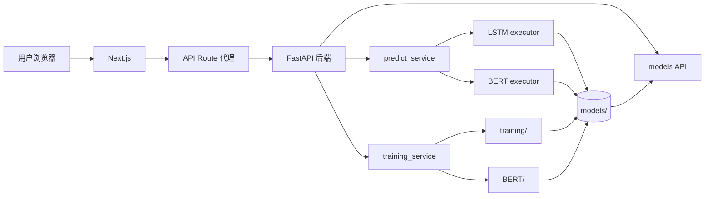
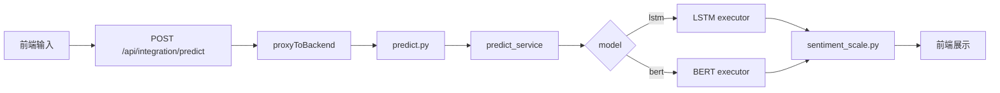
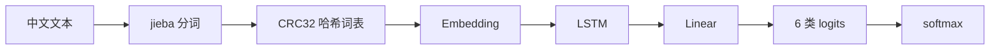
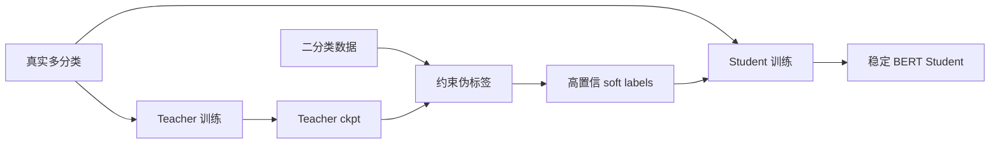

<style>
/* ============================================
   Low-contrast warm palette
   Everything lives in a narrow tonal band
   ============================================ */
:root {
  --bg:      #EDE9E3;
  --surface: #F5F3F0;
  --surface2:#E5E1DA;
  --divider: #CBC6BD;
  --cover:   #C2B9AC;
  --text:    #5E5A55;
  --muted:   #8E8A85;
  --light:   #A8A49F;
  --accent:  #738573;
  --accent2: #A88962;
  --rose:    #B0877F;
  --border:  #DDD9D2;
}

/* Base */
.slidev-layout {
  font-family: 'Inter', 'Noto Sans SC', system-ui, -apple-system, sans-serif;
  color: var(--text);
  background: var(--bg);
  padding: 3.5rem 4.5rem !important;
}

.slidev-layout h1 {
  font-weight: 600;
  letter-spacing: -0.022em;
  line-height: 1.2;
  color: var(--text);
}

.slidev-layout h2 { font-weight: 600; letter-spacing: -0.016em; color: var(--text); }
.slidev-layout h3 { font-weight: 600; letter-spacing: -0.01em;  color: var(--text); }
.slidev-layout p, .slidev-layout li {
  font-size: 0.93rem; line-height: 1.65; color: var(--muted);
}

/* ---------- Cover ---------- */
.cover-slide {
  background: var(--cover) !important;
  color: #F0EDE7 !important;
}
.cover-slide h1 {
  font-size: 4rem !important;
  font-weight: 600 !important;
  letter-spacing: -0.032em !important;
  color: #F0EDE7 !important;
}
.cover-slide .cover-line {
  width: 40px; height: 1px;
  background: rgba(0,0,0,0.1);
  margin: 1.25rem auto;
}

/* ---------- Section divider ---------- */
.section-slide {
  background: var(--divider) !important;
  color: var(--text) !important;
}
.section-slide h1 {
  font-size: 3rem !important;
  font-weight: 600 !important;
  letter-spacing: -0.028em !important;
  color: var(--text) !important;
}
.sec-num {
  font-size: 0.75rem;
  font-weight: 600;
  letter-spacing: 0.14em;
  text-transform: uppercase;
  color: var(--muted);
  margin-bottom: 0.5rem;
}
.sec-sub {
  font-size: 1rem;
  line-height: 1.7;
  color: var(--light);
  max-width: 460px;
  margin-inline: auto;
}

/* ---------- Card ---------- */
.card {
  background: var(--surface);
  border: 1px solid var(--border);
  border-radius: 10px;
  padding: 1.15rem 1.35rem;
}
.card-l { border-left: 2px solid var(--accent); }
.card-w { border-left: 2px solid var(--accent2); }
.card-r { border-left: 2px solid var(--rose); }

/* Alternate surface card (NOT dark — just a different warm tone) */
.card-alt {
  background: var(--surface2);
  border: 1px solid var(--border);
  border-radius: 10px;
  padding: 1.15rem 1.35rem;
}

/* ---------- Callout ---------- */
.callout {
  border-radius: 7px;
  padding: 0.65rem 0.9rem;
  font-size: 0.88rem;
  line-height: 1.5;
}
.co-g { background: rgba(115,133,115,0.07); border-left: 2px solid var(--accent); }
.co-w { background: rgba(168,137,98,0.06);  border-left: 2px solid var(--accent2); }
.co-r { background: rgba(176,135,127,0.06); border-left: 2px solid var(--rose); }
.co-p { background: var(--surface); border: 1px solid var(--border); }

/* ---------- Badge ---------- */
.badge {
  display: inline-flex; align-items: center;
  padding: 0.12rem 0.6rem;
  border-radius: 9999px;
  font-size: 0.62rem; font-weight: 600;
  letter-spacing: 0.06em; text-transform: uppercase;
}
.bd-g { background: rgba(115,133,115,0.12); color: var(--accent); }
.bd-w { background: rgba(168,137,98,0.12);  color: var(--accent2); }
.bd-m { background: rgba(142,138,133,0.08); color: var(--muted); }
.bd-s { background: rgba(255,255,255,0.12); color: rgba(255,255,255,0.6); }

/* ---------- Step ---------- */
.step {
  display: inline-flex; align-items: center; justify-content: center;
  width: 1.25rem; height: 1.25rem; border-radius: 50%;
  background: var(--accent); color: #F5F3F0;
  font-size: 0.6rem; font-weight: 700;
  margin-right: 0.4rem; flex-shrink: 0;
}

/* ---------- Pill ---------- */
.pill {
  display: inline-flex; align-items: center;
  padding: 0.2rem 0.7rem; border-radius: 9999px;
  font-size: 0.72rem; font-weight: 500;
  background: rgba(0,0,0,0.08);
  color: #6B6560;
  border: 1px solid rgba(0,0,0,0.06);
}

/* ---------- Table ---------- */
table {
  width: 100%; border-collapse: separate; border-spacing: 0;
  border-radius: 7px; overflow: hidden; border: 1px solid var(--border);
}
thead { background: var(--surface2); }
th {
  padding: 0.4rem 0.6rem; font-size: 0.62rem; font-weight: 600;
  text-transform: uppercase; letter-spacing: 0.06em;
  color: var(--muted); text-align: left; border-bottom: 1px solid var(--border);
}
td {
  padding: 0.35rem 0.6rem; font-size: 0.8rem;
  border-bottom: 1px solid rgba(0,0,0,0.03); background: var(--surface);
}
tr:last-child td { border-bottom: none; }

/* ---------- Code ---------- */
.slidev-code { border-radius: 8px !important; font-size: 0.72rem !important; }

/* ---------- Flow chips ---------- */
.flow-row { display: grid; grid-template-columns: repeat(4,1fr); gap: 0.5rem; }
.flow-chip {
  background: var(--surface); border: 1px solid var(--border);
  border-radius: 6px; padding: 0.45rem 0.6rem; font-size: 0.7rem;
}

/* ---------- Closing ---------- */
.closing-slide {
  background: var(--cover) !important;
  color: #F0EDE7 !important;
}
.closing-slide h1 {
  font-size: 2.6rem !important; font-weight: 600 !important;
  letter-spacing: -0.022em !important; color: #F0EDE7 !important;
}

/* ---------- Interactive demo ---------- */
.demo-box {
  background: var(--surface); border: 1px solid var(--border);
  border-radius: 12px; padding: 1.25rem; text-align: center;
}
.demo-btn {
  display: inline-flex; align-items: center; gap: 0.3rem;
  padding: 0.45rem 1.1rem; border-radius: 9999px; border: none;
  background: var(--accent); color: #F5F3F0; font-size: 0.8rem; font-weight: 600;
  cursor: pointer; transition: all 0.15s;
}
.demo-btn:hover { background: #657565; }
.demo-score { font-size: 2.2rem; font-weight: 700; color: var(--accent); }
.demo-bar {
  height: 4px; border-radius: 2px; background: var(--accent);
  transition: width 0.5s ease;
}

/* ---------- Quote ---------- */
.quote-slide { background: var(--divider); }
.quote-slide blockquote {
  font-family: 'Georgia', 'Noto Serif SC', serif;
  font-size: 1.6rem; font-weight: 400; line-height: 1.65;
  font-style: italic; color: var(--text);
  border: none; max-width: 600px; margin: 0 auto;
}

/* ---------- Stat card ---------- */
.stat-card {
  background: var(--surface); border: 1px solid var(--border);
  border-radius: 10px; padding: 1.15rem; text-align: center;
}
</style>

<!-- ============================================================
     COVER
     ============================================================ -->
---
layout: center
class: cover-slide
---

<div class="text-center">

# SentimentFlow

<div class="cover-line"></div>

<div class="text-xl font-light tracking-wide" style="color:#8A8580;">
中文情感分析全栈系统
</div>

<div class="mt-4 text-sm" style="color:#9E9993;">
0-5 六档情感评分 &nbsp;·&nbsp; 在线推理 &nbsp;·&nbsp; 后台训练 &nbsp;·&nbsp; 模型管理
</div>

<div class="mt-10 flex flex-wrap justify-center gap-2">
  <span class="pill">Next.js</span>
  <span class="pill">FastAPI</span>
  <span class="pill">PyTorch</span>
  <span class="pill">Transformers</span>
  <span class="pill">Docker</span>
</div>

</div>

<!--
开场定调：SentimentFlow 是打通训练、管理、推理和交互的完整工程闭环。
-->

<!-- ============================================================
     TOC
     ============================================================ -->
---

# 汇报结构

<div class="grid grid-cols-2 gap-4 mt-10">

<div class="card card-l">
  <div class="badge bd-g mb-3">Part 01</div>
  <h3>项目目标与核心价值</h3>
  <p class="mt-1 text-sm">解决什么问题，为什么要做 0-5 六档评分。</p>
</div>

<div class="card card-w">
  <div class="badge bd-w mb-3">Part 02</div>
  <h3>整体架构与请求链路</h3>
  <p class="mt-1 text-sm">从浏览器、API 代理到 LSTM/BERT 执行器。</p>
</div>

<div class="card card-l">
  <div class="badge bd-g mb-3">Part 03</div>
  <h3>模型路线与训练策略</h3>
  <p class="mt-1 text-sm">LSTM baseline、BERT 主力、Teacher/Student 伪标签。</p>
</div>

<div class="card card-w">
  <div class="badge bd-w mb-3">Part 04</div>
  <h3>部署、测试与演示</h3>
  <p class="mt-1 text-sm">Docker Compose、质量保障和答辩演示路线。</p>
</div>

</div>

<!-- ============================================================
     SECTION 01
     ============================================================ -->
---
layout: center
class: section-slide
---

<div class="text-center">

<div class="sec-num">Part 01</div>
<h1>项目目标</h1>
<div class="sec-sub mt-5">让中文情感分析从"脚本可跑"变成"系统可用"</div>

</div>

<!-- ============================================================
     WHY
     ============================================================ -->
---

# 为什么需要 SentimentFlow

<div class="grid grid-cols-2 gap-5 mt-7">

<div>
  <h3 class="text-base mb-3">传统做法的痛点</h3>
  <div class="space-y-2.5">

<div class="callout co-r">
  <div class="font-semibold mb-0.5" style="color:var(--rose);">粒度不足</div>
  <p class="text-sm">二分类只能判断正负，无法表达轻微负面、明显正面等情绪强度。</p>
</div>

<div class="callout co-w">
  <div class="font-semibold mb-0.5" style="color:var(--accent2);">工程割裂</div>
  <p class="text-sm">训练、推理、前端各自为政，标签契约容易不一致。</p>
</div>

<div class="callout co-p">
  <div class="font-semibold mb-0.5">难以演示</div>
  <p class="text-sm">训练过程、模型切换、推理结果缺少统一界面。</p>
</div>

  </div>
</div>

<div>
  <h3 class="text-base mb-3">项目给出的方案</h3>
  <div class="grid grid-cols-2 gap-2">

<div class="callout co-g">
  <div class="font-semibold text-sm" style="color:var(--accent);">0-5 六档评分</div>
  <p class="text-xs mt-0.5">统一契约表达情绪方向与强度。</p>
</div>

<div class="callout co-g">
  <div class="font-semibold text-sm" style="color:var(--accent);">LSTM + BERT</div>
  <p class="text-xs mt-0.5">轻量 baseline 与语义主力并行。</p>
</div>

<div class="callout co-g">
  <div class="font-semibold text-sm" style="color:var(--accent);">训练闭环</div>
  <p class="text-xs mt-0.5">前端启动训练，SSE 推送日志指标。</p>
</div>

<div class="callout co-g">
  <div class="font-semibold text-sm" style="color:var(--accent);">模型管理</div>
  <p class="text-xs mt-0.5">扫描、启用、删除和展示模型。</p>
</div>

  </div>
</div>

</div>

<!-- ============================================================
     DELIVERY
     ============================================================ -->
---

# 项目交付能力

<div class="grid grid-cols-3 gap-4 mt-10">

<div class="stat-card">
  <div class="badge bd-m mb-3">面向用户</div>
  <h3 class="mb-1">情感预测</h3>
  <p class="text-sm">输入中文文本，返回 0-5 分数、标签、置信度、六档概率和解释。</p>
</div>

<div class="stat-card">
  <div class="badge bd-m mb-3">面向训练</div>
  <h3 class="mb-1">后台训练</h3>
  <p class="text-sm">前端配置模型与超参数，后台线程训练，SSE 实时推送进度。</p>
</div>

<div class="stat-card">
  <div class="badge bd-m mb-3">面向运营</div>
  <h3 class="mb-1">模型管理</h3>
  <p class="text-sm">扫描 models/，展示大小与指标，切换活跃模型与安全删除。</p>
</div>

</div>

<div class="mt-8 callout co-g text-center">
  核心目标：数据处理 → 训练 → 保存 → 管理 → 推理 → 展示 → 测试，完整闭环。
</div>

<!-- ============================================================
     SECTION 02
     ============================================================ -->
---
layout: center
class: section-slide
---

<div class="text-center">

<div class="sec-num">Part 02</div>
<h1>系统架构</h1>
<div class="sec-sub mt-5">从浏览器点击到模型输出，链路清晰可追踪</div>

</div>

<!-- ============================================================
     ARCHITECTURE
     ============================================================ -->
---

# 整体架构图

<div class="mt-1">



</div>

<div class="flow-row mt-5">
  <div class="flow-chip"><strong>前端</strong><br/><code>frontend/app/</code></div>
  <div class="flow-chip"><strong>入口</strong><br/><code>backend/main.py</code></div>
  <div class="flow-chip"><strong>契约</strong><br/><code>sentiment_scale.py</code></div>
  <div class="flow-chip"><strong>产物</strong><br/><code>models/</code></div>
</div>

<!-- ============================================================
     0-5 CONTRACT
     ============================================================ -->
---

# 统一契约：0-5 情感评分

<div class="grid grid-cols-[0.85fr_1.15fr] gap-5 mt-3">

<div>

| 分 | 中文标签 | 英文标签 |
|:--:|:---|:---|
| 0 | 极端负面 | `extremely_negative` |
| 1 | 明显负面 | `clearly_negative` |
| 2 | 略微负面 | `slightly_negative` |
| 3 | 中性 | `neutral` |
| 4 | 略微正面 | `slightly_positive` |
| 5 | 极端正面 | `extremely_positive` |

</div>

<div class="space-y-2">

<div class="callout co-g">
  <div class="font-semibold mb-0.5" style="color:var(--accent);">为什么它是核心</div>
  <p class="text-sm"><code>sentiment_scale.py</code> 让训练、推理、API、前端都围绕同一套标签工作。</p>
</div>

<div class="callout co-p text-sm"><strong>输入统一</strong> — 二分类、星级、10 分制映射到 0-5。</div>
<div class="callout co-p text-sm"><strong>输出统一</strong> — 长度为 6 的概率数组，索引即分数。</div>
<div class="callout co-p text-sm"><strong>指标统一</strong> — Accuracy、F1、MAE、QWK、Spearman 在同一契约上计算。</div>

</div>

</div>

<!-- ============================================================
     TWO FLOWS
     ============================================================ -->
---

# 两条核心业务链路

<div class="grid grid-cols-2 gap-5 mt-6">

<div class="card card-l">
  <div class="badge bd-g mb-3">Predict Flow</div>
  <h3 class="mb-3">在线预测</h3>
  <div class="space-y-1.5 text-sm">
    <p class="flex items-center"><span class="step">1</span> 用户输入文本</p>
    <p class="flex items-center"><span class="step">2</span> API Route 转发请求</p>
    <p class="flex items-center"><span class="step">3</span> 选择 LSTM 或 BERT</p>
    <p class="flex items-center"><span class="step">4</span> 模型输出六档概率</p>
    <p class="flex items-center"><span class="step">5</span> 前端展示评分与概率条</p>
  </div>
</div>

<div class="card card-w">
  <div class="badge bd-w mb-3">Training Flow</div>
  <h3 class="mb-3">后台训练</h3>
  <div class="space-y-1.5 text-sm">
    <p class="flex items-center"><span class="step">1</span> 选择模型、数据集、超参数</p>
    <p class="flex items-center"><span class="step">2</span> 创建 job_id，启动后台线程</p>
    <p class="flex items-center"><span class="step">3</span> SSE 实时推送训练日志</p>
    <p class="flex items-center"><span class="step">4</span> 模型保存到 models/</p>
    <p class="flex items-center"><span class="step">5</span> 自动切换为活跃模型</p>
  </div>
</div>

</div>

<div class="mt-5 callout co-g text-sm text-center">
  两条链路复用同一套评分契约、模型目录和模型选择机制。
</div>

<!-- ============================================================
     PREDICT PATH
     ============================================================ -->
---

# 一次预测请求如何走完



<div class="grid grid-cols-[1fr_1.3fr] gap-5 mt-4">

<div class="callout co-g text-sm">
  <div class="font-semibold mb-2">关键护栏</div>
  <div class="space-y-1">
    <p>· Pydantic 限制 text 长度</p>
    <p>· 模型缺失返回 404 + 提示</p>
    <p>· 异常时关键词基线兜底</p>
    <p>· 关键词冲突启用 guard</p>
  </div>
</div>

<div class="card-alt">

```json
{
  "score": 5,
  "label_zh": "极端正面",
  "confidence": 0.9321,
  "probabilities": [
    0.001, 0.002, 0.004,
    0.018, 0.043, 0.932
  ],
  "source": "bert",
  "model_name": "bert_20260509_064555"
}
```

</div>

</div>

<!-- ============================================================
     SECTION 03
     ============================================================ -->
---
layout: center
class: section-slide
---

<div class="text-center">

<div class="sec-num">Part 03</div>
<h1>工程实现</h1>
<div class="sec-sub mt-5">前端、后端和模型层各司其职</div>

</div>

<!-- ============================================================
     FRONTEND
     ============================================================ -->
---

# 前端：三个工作台

<div class="grid grid-cols-[0.95fr_1.05fr] gap-5 mt-6 workbench-grid">

<div class="workbench-stack">

<div class="card card-l workbench-card">
  <div class="workbench-index">01</div>
  <div>
    <h3>IntegrationTestPanel</h3>
    <p>健康检查、预测请求、评分方块、概率条、原始 JSON。</p>
  </div>
</div>

<div class="card card-l workbench-card">
  <div class="workbench-index">02</div>
  <div>
    <h3>TrainingPanel</h3>
    <p>超参数配置、数据集选择、SSE 日志、轮询兜底、任务恢复。</p>
  </div>
</div>

<div class="card card-l workbench-card">
  <div class="workbench-index">03</div>
  <div>
    <h3>ModelManagementPanel</h3>
    <p>模型列表、指标展示、活跃模型切换、安全删除、刷新。</p>
  </div>
</div>

</div>

<div class="card-alt proxy-note">
  <div class="badge bd-m mb-3">Proxy Layer</div>
  <h3>前端代理的价值</h3>
  <div class="proxy-note-list">
    <p><strong>同源</strong><span>浏览器只访问 Next.js 接口，消除 CORS。</span></p>
    <p><strong>探测</strong><span><code>api-proxy.ts</code> 顺序探测 127.0.0.1 / localhost / backend。</span></p>
    <p><strong>缓存</strong><span>记住最近成功的后端地址，减少重复探测。</span></p>
    <p><strong>兜底</strong><span>训练日志断开后自动切换状态轮询。</span></p>
  </div>
</div>

</div>

<!-- ============================================================
     BACKEND
     ============================================================ -->
---

# 后端：三层架构

<div class="grid grid-cols-3 gap-4 mt-8">

<div class="stat-card">
  <div class="badge bd-m mb-3">API Layer</div>
  <h3 class="mb-1">HTTP 契约</h3>
  <div class="text-sm space-y-0.5">
    <p><code>/health</code></p>
    <p><code>/api/predict/</code></p>
    <p><code>/api/training/*</code></p>
    <p><code>/api/models/*</code></p>
  </div>
</div>

<div class="stat-card">
  <div class="badge bd-m mb-3">Service Layer</div>
  <h3 class="mb-1">业务编排</h3>
  <div class="text-sm space-y-0.5">
    <p>· 模型选择与检查</p>
    <p>· 关键词 guard</p>
    <p>· 后台训练线程</p>
    <p>· 日志与指标解析</p>
  </div>
</div>

<div class="stat-card">
  <div class="badge bd-m mb-3">Model Layer</div>
  <h3 class="mb-1">推理执行</h3>
  <div class="text-sm space-y-0.5">
    <p>· LSTM checkpoint 加载</p>
    <p>· BERT checkpoint 校验</p>
    <p>· GPU / CPU 设备选择</p>
    <p>· 概率到评分转换</p>
  </div>
</div>

</div>

<div class="mt-6 callout co-g text-sm">
  <code>main.py</code> 在 lifespan 中预加载活跃模型，减少首次预测冷启动延迟。
</div>

<!-- ============================================================
     MODEL MANAGEMENT
     ============================================================ -->
---

# 模型管理

<div class="grid grid-cols-[1fr_1fr] gap-6 mt-6">

<div>
  <h3 class="mb-3 text-base">后端如何识别模型</h3>
  <div class="space-y-2">
    <div class="callout co-g text-sm"><strong>LSTM</strong> — 目录内存在 <code>.pt</code> checkpoint。</div>
    <div class="callout co-g text-sm"><strong>BERT</strong> — 存在 <code>config.json</code> + <code>model.safetensors</code>。</div>
    <div class="callout co-p text-sm"><strong>元信息</strong> — 读取 <code>training_meta.json</code>，无需加载权重。</div>
  </div>
</div>

<div>
  <h3 class="mb-3 text-base">前端展示哪些信息</h3>

| 字段 | 用途 |
|:---|:---|
| `model_id` | 目录名，含类型与时间戳 |
| `size_mb` | 模型体积，便于清理 |
| `best_f1` | 最佳 F1 表现 |
| `best_mae` | 有序误差指标 |
| `best_qwk` | 有序评分一致性 |
| `best_epoch` | 最佳 epoch |

</div>

</div>

<div class="mt-4 callout co-w text-sm">
  删除保护：确认目标路径位于 <code>models/</code> 目录内部，避免误删项目外文件。
</div>

<!-- ============================================================
     SECTION 04
     ============================================================ -->
---
layout: center
class: section-slide
---

<div class="text-center">

<div class="sec-num">Part 04</div>
<h1>模型与训练策略</h1>
<div class="sec-sub mt-5">轻量 baseline 与语义主力模型并行</div>

</div>

<!-- ============================================================
     LSTM
     ============================================================ -->
---

# LSTM 路线



<div class="grid grid-cols-2 gap-5 mt-6">

<div class="callout co-g">
  <div class="font-semibold mb-1" style="color:var(--accent);">轻量 · 快速 · 可解释</div>
  <p class="text-sm">快速跑通训练闭环，适合作为 baseline 和答辩演示。</p>
</div>

<div>
  <div class="callout co-p text-sm mb-2">
    <strong>核心文件：</strong><code>training/model.py</code>、<code>trainer.py</code>、<code>LSTM/executor.py</code>
  </div>
  <div class="callout co-w text-sm">
    <strong>局限：</strong>哈希冲突、上下文理解弱，复杂中文下不如 BERT。
  </div>
</div>

</div>

<!-- ============================================================
     BERT
     ============================================================ -->
---

# BERT / RoBERTa 路线

<div class="grid grid-cols-2 gap-5 mt-5">

<div class="card-alt">
  <h3 class="mb-3">推理路径</h3>
  <div class="space-y-1.5 text-sm">
    <p class="flex items-center"><span class="step">1</span> HuggingFace tokenizer 生成 input_ids</p>
    <p class="flex items-center"><span class="step">2</span> <code>hfl/chinese-roberta-wwm-ext</code> 语义表示</p>
    <p class="flex items-center"><span class="step">3</span> Dropout + Linear → 6 类 logits</p>
    <p class="flex items-center"><span class="step">4</span> softmax → 统一评分契约</p>
  </div>
</div>

<div>
  <h3 class="mb-3 text-base">训练优化点</h3>
  <div class="grid grid-cols-2 gap-2">
    <div class="callout co-p text-sm">批量 tokenizer</div>
    <div class="callout co-p text-sm">类别均衡 + focal loss</div>
    <div class="callout co-p text-sm">梯度 checkpoint</div>
    <div class="callout co-p text-sm">混合精度训练</div>
    <div class="callout co-p text-sm">QWK 选模指标</div>
    <div class="callout co-p text-sm">HF 兼容 checkpoint</div>
  </div>
</div>

</div>

<!-- ============================================================
     TEACHER / STUDENT
     ============================================================ -->
---

# Teacher / Student 策略

<div class="grid grid-cols-2 gap-5 mt-5">

<div class="card card-l">
  <div class="badge bd-g mb-2">Teacher</div>
  <h3 class="mb-2">只学真实多分类</h3>
  <div class="text-sm space-y-1">
    <p>· <code>BerlinWang/DMSC</code></p>
    <p>· <code>dirtycomputer/JD_review</code></p>
    <p>· 目标：先学会 0-5 情感强度区分</p>
  </div>
</div>

<div class="card card-w">
  <div class="badge bd-w mb-2">Student</div>
  <h3 class="mb-2">融合真实与软伪标签</h3>
  <div class="text-sm space-y-1">
    <p>· Teacher 对二分类数据生成六档概率</p>
    <p>· 弱标签约束：负面 0/1/2，正面 4/5</p>
    <p>· 低置信度伪标签直接丢弃</p>
  </div>
</div>

</div>



<!-- ============================================================
     LOSS & METRICS
     ============================================================ -->
---

# 有序损失与评估指标

<div class="grid grid-cols-2 gap-5 mt-5">

<div class="card-alt">
  <div class="badge bd-m mb-3">Loss Function</div>
  <h3 class="mb-3">DistanceAwareOrdinalLoss</h3>
  <p class="text-sm">
    CrossEntropy 只知道"对/错"。0-5 有顺序，在 CE 外加入距离惩罚：
  </p>
  <div class="mt-3 rounded px-3 py-2 text-sm text-center font-mono" style="background:rgba(0,0,0,0.03);">
    total = CE + SmoothL1( E[pred], E[target] )
  </div>
</div>

<div>
  <h3 class="mb-3 text-base">为什么不能只看 Accuracy</h3>

| 指标 | 关注点 |
|:---|:---|
| `Macro-F1` | 少数类别是否被忽略 |
| `Weighted-F1` | 整体加权分类表现 |
| `MAE / RMSE` | 预测离真实有多远 |
| `QWK` | 有序评分一致性 |
| `Spearman` | 情绪排序一致性 |

</div>

</div>

<!-- ============================================================
     SECTION 05
     ============================================================ -->
---
layout: center
class: section-slide
---

<div class="text-center">

<div class="sec-num">Part 05</div>
<h1>交付与验证</h1>
<div class="sec-sub mt-5">能启动、能训练、能解释、能维护</div>

</div>

<!-- ============================================================
     DEPLOYMENT
     ============================================================ -->
---

# 部署与运行

<div class="grid grid-cols-2 gap-5 mt-5">

<div>
  <h3 class="mb-3 text-base">本地开发</h3>

```powershell
cd backend
uvicorn app.main:app --port 8846

cd frontend
yarn dev
```

  <p class="text-xs mt-2" style="color:var(--light);">前端 :3000 &nbsp;·&nbsp; 后端 :8846 &nbsp;·&nbsp; PPT :3030</p>
</div>

<div>
  <h3 class="mb-3 text-base">Docker Compose</h3>

```powershell
cd C:\Code\SentimentFlow
docker compose up
```

  <p class="text-xs mt-2" style="color:var(--light);">前端 :30008 &nbsp;·&nbsp; 后端 :8846 &nbsp;·&nbsp; PPT :3031</p>
</div>

</div>

<div class="mt-4 callout co-g text-sm">
  关键环境变量：<code>PREDICT_MODEL_TYPE</code> · <code>MODEL_PATH</code> · <code>BERT_CHECKPOINT_PATH</code> · <code>BACKEND_API_URL</code>
</div>

<!-- ============================================================
     TESTING & DEMO
     ============================================================ -->
---

# 测试保障 & 演示路线

<div class="grid grid-cols-2 gap-5 mt-6">

<div>
  <h3 class="mb-3 text-base">测试策略</h3>
  <div class="space-y-2">
    <div class="callout co-p text-sm"><strong>契约测试</strong> — 二分类/星级/10 分制 → 0-5</div>
    <div class="callout co-p text-sm"><strong>推理测试</strong> — 概率 6 类，字段稳定</div>
    <div class="callout co-p text-sm"><strong>BERT 测试</strong> — soft label，数据集选择</div>
    <div class="callout co-p text-sm"><strong>前端校验</strong> — TypeScript + Next.js build</div>
  </div>
</div>

<div>
  <h3 class="mb-3 text-base">答辩演示路线</h3>
  <div class="space-y-1.5 text-sm">
    <p class="callout co-p flex items-center"><span class="step">1</span> 打开三标签页首页</p>
    <p class="callout co-p flex items-center"><span class="step">2</span> 模型管理：展示 + 切换</p>
    <p class="callout co-p flex items-center"><span class="step">3</span> 情感预测：输入文本看结果</p>
    <p class="callout co-p flex items-center"><span class="step">4</span> 训练面板：SSE + 指标</p>
    <p class="callout co-g flex items-center"><span class="step">5</span> 代码：契约 → 服务 → 模型</p>
    <p class="callout co-g flex items-center"><span class="step">6</span> 收束：闭环 · 契约 · Docker</p>
  </div>
</div>

</div>

<!-- ============================================================
     INTERACTIVE
     ============================================================ -->
---
layout: center
---

# 互动演示

<SentimentDemo />

<!-- ============================================================
     QUOTE
     ============================================================ -->
---
layout: center
class: quote-slide
---

<div class="text-center">

<blockquote>
把数据处理到模型训练、模型管理、<br/>
在线推理、前端展示、测试保障<br/>
连成一个完整的工程闭环。
</blockquote>

<div class="mt-6 text-xs tracking-widest uppercase" style="color:var(--light);">
SentimentFlow 核心价值
</div>

</div>

<!-- ============================================================
     FUTURE
     ============================================================ -->
---

# 后续方向

<div class="grid grid-cols-2 gap-4 mt-8">

<div class="card">
  <h3 class="mb-1">训练任务持久化</h3>
  <p class="text-sm">任务状态从进程内存迁移到数据库，保存历史训练记录。</p>
</div>

<div class="card">
  <h3 class="mb-1">权限与用户系统</h3>
  <p class="text-sm">auth / admin / stats 占位接口扩展为完整权限后台。</p>
</div>

<div class="card">
  <h3 class="mb-1">实验追踪与版本管理</h3>
  <p class="text-sm">记录数据集、超参数、指标曲线，实现可复现实验。</p>
</div>

<div class="card">
  <h3 class="mb-1">推理性能优化</h3>
  <p class="text-sm">推进 ONNX 导出、量化、批量推理和缓存机制。</p>
</div>

</div>

<!-- ============================================================
     CLOSING
     ============================================================ -->
---
layout: center
class: closing-slide
---

<div class="text-center">

# 谢谢

<div class="mt-6 text-xl font-light tracking-wide" style="color:#9E9993;">
SentimentFlow · 中文情感分析全栈系统
</div>

<div class="mt-3 text-sm" style="color:#A8A49F;">
可训练 · 可管理 · 可推理 · 可演示 · 可维护
</div>

<div class="mt-10 text-xs" style="color:#B5B0A8;">
欢迎提问
</div>

</div>
